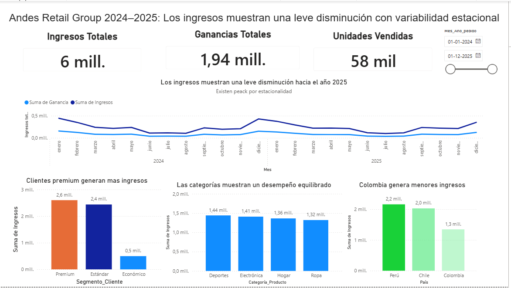
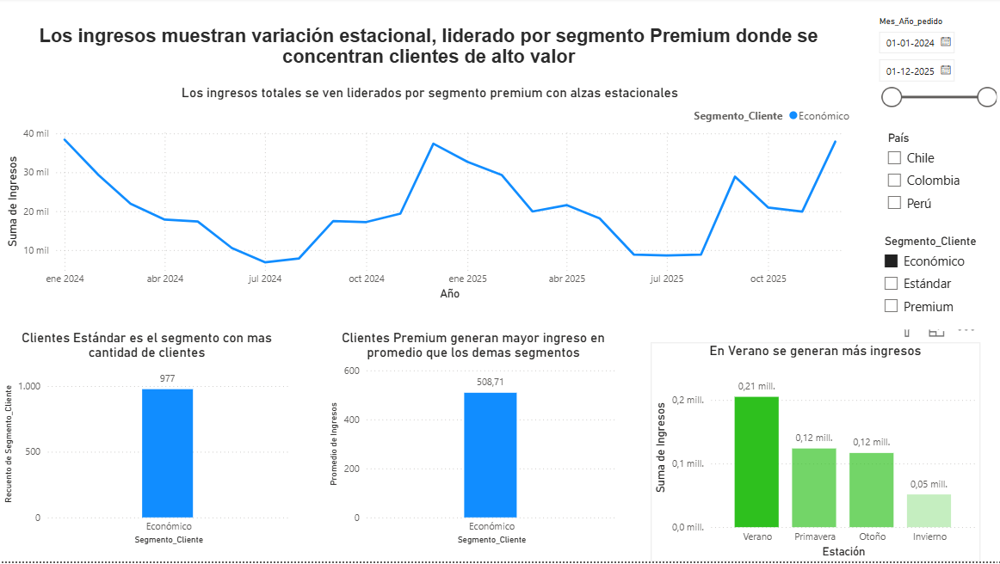

📊 Análisis de Desempeño Comercial | Andes Retail Group

📌 Descripción del proyecto

Proyecto de análisis comercial desarrollado en Power BI a partir de datos transaccionales de Andes Retail Group, empresa ficticia de retail con operaciones en Chile, Perú y Colombia.

El análisis comprende el período 2024–2025 y busca transformar los datos de ventas en información útil para evaluar el desempeño comercial, identificar patrones y apoyar la toma de decisiones.

🎯 Objetivo

Analizar el comportamiento de los ingresos, ganancias, unidades vendidas y clientes para identificar diferencias entre segmentos, categorías de productos, países y períodos del año.

El análisis busca responder preguntas como:

¿Cómo evolucionaron los ingresos durante 2024–2025?

¿Qué segmentos de clientes generan mayor valor?

¿Qué categorías tienen mayor impacto en el negocio?

¿Existen diferencias entre países?

¿Qué patrones estacionales se observan?

¿Dónde existen oportunidades de mejora comercial?

🛠️ Herramientas

Power BI

Power Query

DAX

Excel

Git / GitHub

📈 KPIs principales

El dashboard considera como indicadores principales:

Ingresos totales

Ganancias totales

Unidades vendidas

La ganancia fue obtenida a partir de los ingresos y costos asociados a las ventas.

🖥️ Dashboard

El dashboard fue diseñado en dos niveles de análisis.

Vista 1 — Overview ejecutivo

Presenta una visión general del desempeño comercial mediante KPIs y visualizaciones orientadas a analizar:

evolución temporal de ingresos y ganancias;

ingresos por segmento de clientes;

desempeño por categoría de producto;

comparación de ingresos entre países.



Vista 2 — Análisis detallado

Profundiza en los factores que pueden explicar el comportamiento de los ingresos mediante:

evolución temporal por segmento de clientes;

ingreso promedio por segmento;

cantidad de clientes por segmento;

comportamiento de los ingresos según estación del año;

filtros por fecha, país y segmento.



🔎 Principales hallazgos

El análisis permitió identificar algunos patrones relevantes:

Los ingresos presentan variaciones estacionales, con un mejor desempeño durante el verano y una disminución durante el invierno.

El segmento Premium presenta un mayor ingreso promedio, aun cuando no concentra la mayor cantidad de clientes.

El segmento Estándar concentra una mayor cantidad de clientes, lo que plantea una oportunidad para desarrollar estrategias orientadas a aumentar su valor comercial.

Las categorías de productos presentan comportamientos relativamente similares.

Se observan diferencias geográficas en el aporte de ingresos entre Chile, Perú y Colombia.

💡 Recomendaciones comerciales

A partir de los patrones observados, se plantean como oportunidades:

desarrollar estrategias de fidelización dirigidas al segmento Premium;

evaluar acciones que permitan aumentar el valor de clientes del segmento Estándar;

reforzar las acciones comerciales durante los períodos de menor desempeño;

planificar campañas y capacidad comercial para aprovechar los períodos de mayor demanda.

📂 Estructura del repositorio
```text
├── dashboard/
│   └── archivo Power BI (.pbix)
│
├── data/
│   └── dataset del proyecto (.xlsx)
│
├── images/
│   ├── dashboard_overview.png
│   └── dashboard_detalle.png
│
└── README.md
```
🚧 Próximas mejoras

Este proyecto continuará evolucionando. Entre las mejoras planificadas se encuentran:

ampliar la documentación de las transformaciones realizadas en Power Query;

incorporar métricas adicionales de rentabilidad;

mejorar la trazabilidad de los cálculos;

incorporar una matriz de detalle para pedidos y clientes;

fortalecer los insights mediante valores y comparaciones cuantitativas;

continuar optimizando la presentación visual del dashboard.
